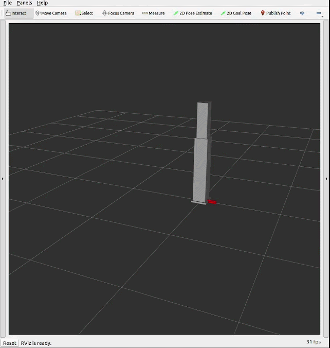

# LC3 ROS2 Hardware Interface

ROS2 hardware interface for LC3 lifting column using Modbus TCP communication.

## Overview

This package provides a ros2_control hardware interface for controlling LC3 linear actuators/lifting columns via Modbus TCP protocol.

## Features

- Full ros2_control SystemInterface implementation
- Modbus TCP communication
- Position
- Automatic retraction on shutdown
- Standalone URDF and launch file for independent use
- Joint trajectory controller with trajectory interpolation
- Joint limits enforced (0.0 to 0.9 meters)

## Dependencies

- ROS2 Humble
- libmodbus (install: `sudo apt install libmodbus-dev`)
- ros2_control
- ros2_controllers
- hardware_interface
- pluginlib
- controller_manager
- robot_state_publisher
- xacro

## Configuration

The hardware interface connects to the LC3 column at:
- IP: 192.168.1.10
- Port: 502
- Slave ID: 1

These can be modified in `include/lc3_hw_interface/lc3_hardware_interface.hpp` if needed.

## Build

```bash
cd ~/ros2_ws
colcon build --packages-select lc3_hw_interface
source install/setup.bash
```

## Usage

### Standalone Mode

Launch the LC3 column controller independently:

```bash
ros2 launch lc3_hw_interface lc3_column.launch.py
```

**With mock hardware (for testing without real hardware):**
```bash
ros2 launch lc3_hw_interface lc3_column.launch.py use_mock_hardware:=true
```

**Controller Selection:**

By default, the `ForwardCommandController` is used (recommended for real hardware). For simulation/testing mode, set `simulation:=true` to use `JointTrajectoryController`:

```bash
# Default: ForwardCommandController (real hardware)
ros2 launch lc3_hw_interface lc3_column.launch.py

# Simulation mode: JointTrajectoryController with mock hardware
ros2 launch lc3_hw_interface lc3_column.launch.py simulation:=true use_mock_hardware:=true
```

**Available launch parameters:**
- `use_mock_hardware`: Use GenericSystem mock instead of real hardware (default: false)
- `simulation`: Use JointTrajectoryController for simulation/testing (default: false, uses ForwardCommandController)
- `use_rviz`: Launch RViz visualization (default: true)

### Control the Column

**Default mode (ForwardCommandController - real hardware):**

Send position commands directly via topic:

```bash
# Extend to 10 cm
ros2 topic pub --once /column_position_controller/commands std_msgs/msg/Float64MultiArray "data: [0.1]"

# Retract to 0
ros2 topic pub --once /column_position_controller/commands std_msgs/msg/Float64MultiArray "data: [0.0]"

# Extend to maximum (90 cm)
ros2 topic pub --once /column_position_controller/commands std_msgs/msg/Float64MultiArray "data: [0.9]"
```



**Simulation mode (JointTrajectoryController - use `simulation:=true`):**

Send position commands using trajectory actions or topics:

**Using action interface (recommended):**
```bash
# Extend to 10 cm with 2 second trajectory
ros2 action send_goal /column_position_controller/follow_joint_trajectory control_msgs/action/FollowJointTrajectory "{
  trajectory: {
    joint_names: [column_joint],
    points: [
      { positions: [0.1], time_from_start: { sec: 2 } }
    ]
  }
}"

# Retract to 0
ros2 action send_goal /column_position_controller/follow_joint_trajectory control_msgs/action/FollowJointTrajectory "{
  trajectory: {
    joint_names: [column_joint],
    points: [
      { positions: [0.0], time_from_start: { sec: 2 } }
    ]
  }
}"

# Extend to maximum (90 cm)
ros2 action send_goal /column_position_controller/follow_joint_trajectory control_msgs/action/FollowJointTrajectory "{
  trajectory: {
    joint_names: [column_joint],
    points: [
      { positions: [0.9], time_from_start: { sec: 5 } }
    ]
  }
}"
```

**Using topic interface (quick commands):**
```bash
# Single position command
ros2 topic pub /column_position_controller/joint_trajectory trajectory_msgs/msg/JointTrajectory "{
  joint_names: [column_joint],
  points: [
    { positions: [0.1], time_from_start: { sec: 2 } }
  ]
}" --once
```

### Monitor Joint States

```bash
ros2 topic echo /joint_states
```

### Integration with Robot

Add to your robot's URDF/xacro:

```xml
<ros2_control name="lc3_column_controller" type="system">
  <hardware>
    <plugin>lc3_hw_interface/LC3HardwareInterface</plugin>
    <param name="column_name">column_joint</param>
  </hardware>
  <joint name="column_joint">
    <command_interface name="position"/>
    <state_interface name="position"/>
    <state_interface name="velocity"/>
  </joint>
</ros2_control>
```
A link for the column in the robot URDF should be defined as well.
## Files

- `urdf/lc3_column.urdf.xacro` - Robot description with LC3 column
- `config/lc3_controllers.yaml` - Controller configuration
- `launch/lc3_column.launch.py` - Launch file to start everything
- `src/lc3_hardware_interface.cpp` - Hardware interface implementation
- `include/lc3_hw_interface/lc3_hardware_interface.hpp` - Header file

## Safety

- The column automatically retracts to position 0 on shutdown (Ctrl+C)
- Position limits enforced: 0.0 m (retracted) to 0.9 m (extended)
- Heartbeat mechanism ensures continuous communication

## License

Apache-2.0
